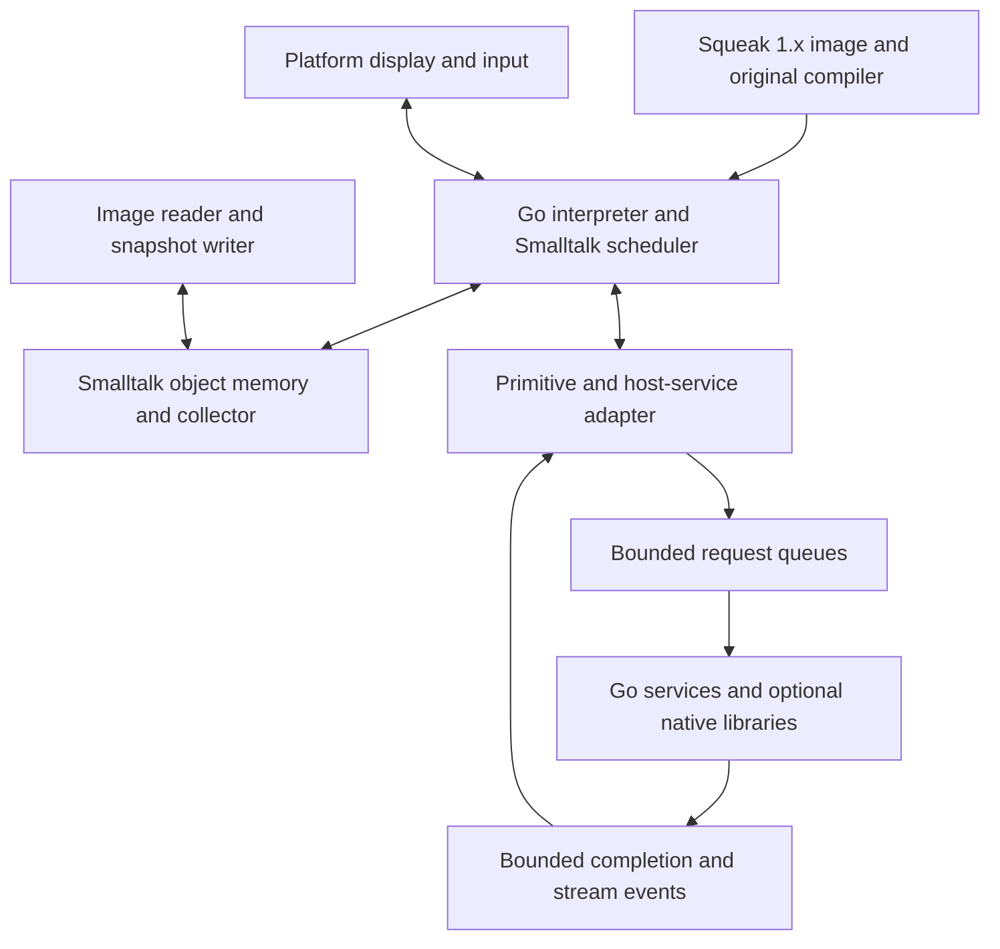

# A Go VM for the original Squeak 1.x system

Status: proposed design; implementation has not started.

## Objective and scope

Build a native VM in Go that runs the actual Squeak 1.x image, including its
class library, compiler, desktop, development tools, and historical execution
behavior. Provide modern host services through an explicit asynchronous boundary.
Allow a subsequent, deliberate conversion to a 64-bit image representation.

The preservation target is the original system, not a recreation of its appearance
on a current Squeak, Cuis, or Pharo image. New Smalltalk libraries may be added;
existing classes and behavior are the compatibility contract. Word-size-related
changes are permitted, but they do not authorize unrelated language or library
upgrades. Necessary compatibility patches must be identified and reviewed as
such, rather than arriving implicitly through a wholesale image update.

This is a separate implementation from the C++ VM already in this repository.
That VM runs the Xerox Smalltalk-80 release-2 image using a 16-bit object model.
Its `files/` and `org/` artifacts are not Squeak bootstrap images. Its architecture
and host-service tests are useful precedents; it is not an execution oracle for
Squeak 1.x. The existing VM and its runnable artifacts remain usable while the
Go implementation is developed.

The first end-to-end milestone is an original Squeak 1.x image that boots on the
Go VM, evaluates source through its own compiler, displays its original desktop,
and saves and resumes in a fresh VM process.

## Decisions and boundaries

| Area | Proposed decision |
|---|---|
| Language | Go for the VM, image tooling, and host-service runtime |
| Initial target | One precisely identified Squeak 1.x release; 1.13 is the initial candidate |
| Host architecture | Native 64-bit executable, with macOS/Apple Silicon the first desktop target |
| Initial image semantics | Preserve the imported image's logical word sizes and integer limits |
| Image modernization | A separately versioned 64-bit conversion after baseline compatibility |
| Execution | Bytecode interpreter first; measured optimization after correctness |
| Object memory | VM-managed storage addressed by tagged values and stable handles |
| Scheduling | Original Smalltalk processes and semaphores on one owner goroutine |
| Parallel work | Host-service goroutines operating on copied data and opaque request IDs |
| Native libraries | Optional cgo adapters with C-compatible wrappers around C++ libraries |
| JIT | A later, separately justified execution backend |

A 64-bit host process, a 64-bit internal reference, and a 64-bit image contract
are different choices. The first two do not require immediately changing what
the original Smalltalk program observes.

Initial exclusions are shared-heap parallel Smalltalk execution, a replacement
Smalltalk compiler or UI, automatic adoption of modern closure semantics, and a
general FFI exposed directly to arbitrary image code. Supporting every Squeak
release is also outside the first compatibility target.

## Establish the compatibility baseline

Before implementing the loader, acquire the selected image and its matching
sources and changes files. Record release identity, provenance, redistribution
terms, hashes, image header, byte order, and any known platform adaptations.
Development and tests operate on copies.

SqueakJS provides an official launcher example for Squeak 1.13 and is a useful
candidate reference runtime [1]. A launcher-provided image must not automatically
be treated as an unmodified release artifact: any adaptations must be recorded.
A compatible traditional native Squeak VM provides a second reference where
available. Pin the reference runtime revisions and verify that they actually
run the chosen image.

Inventory the image's bytecodes, method headers, primitive declarations, special
objects, class formats, context layouts, integer representations, and host I/O
conventions. Determine the primitive subset needed to boot and to compile code.
An unsupported required primitive is a tracked blocker. Optional primitives may
use their original Smalltalk fallback when that fallback exists and is correct.

Compatibility includes old block behavior, non-local returns, debugger-visible
contexts, process priorities, primitive failure, object identity and hashing,
`become:`, object enumeration, and reflective storage access. Preserve observed
legacy quirks unless a separate decision changes them. Native memory corruption
or undefined behavior in a reference implementation is not a required feature.

## Runtime structure



The VM owner alone changes Smalltalk objects, execution state, and scheduler
queues. Workers exchange host-owned values with the owner; they never receive
references into Smalltalk storage. Events enter the image only at explicit VM
safe points.

An initially isolated Go module under `go-vm/` would keep the existing CMake
project independent. A provisional package layout is:

```text
go-vm/
  cmd/squeak-vm/       command-line host
  internal/image/     import, validation, snapshot encoding
  internal/heap/      values, objects, roots, collection
  internal/interp/    bytecodes, primitives, processes, method lookup
  internal/host/      service lifecycle, streams, request registry
  internal/platform/ display, input, clocks and filesystem adapters
  smalltalk/          additive libraries and explicit compatibility patches
  testdata/           fixture manifests and compatibility programs
```

These paths describe a proposed layout, not existing implementation files. A Go
toolchain version and desktop binding will be pinned when implementation begins.

## Object representation and collection

Use a compact tagged value, provisionally backed by `uint64`, for immediates and
object handles. Keep object descriptors and payloads in indexed storage. Separate
pointer fields from byte and word payloads, and route reference stores through a
small heap API. A stable handle permits storage to move without exposing a Go
address to the image.

Internal handles are not serialized addresses and are not automatically the
numeric OOPs exposed by legacy primitives. Import builds a relocation map from
image references to handles; export assigns image addresses independently. Any
address-like reflective primitive needs an explicit legacy representation rule.
Identity hashes and `become:` semantics must be tested rather than inferred from
the convenience of swapping descriptor entries.

Start with a simple tracing collector and an explicit root set. Roots include
special objects, active execution registers, processes and contexts, temporary
primitive values, pending host requests, and queued semaphore notifications.
Initially clear execution caches around collection and identity-changing
operations; optimize their treatment only after correctness is established.
Implement any weak-reference behavior required by the selected image explicitly.

Go's collector manages host allocations and the backing storage, while the VM's
collector follows Smalltalk handles. Integer handles in a slab are not Go
pointers. Every native-held Smalltalk handle therefore requires VM root
registration even if its containing Go object is still live. Keep backing slabs
reachable through ordinary Go references and avoid per-Smalltalk-object Go
allocation in the hot path. Go's GC guidance identifies indexed storage as a
way to reduce pointer-scanning costs [2].

Generational collection, compaction, allocation fast paths, and more precise
cache retention are later optimizations. The initial reference-store boundary
must permit adding write barriers without auditing arbitrary field writes spread
throughout the interpreter.

## Interpreter, contexts, and scheduling

The imported Smalltalk compiler remains responsible for compiling Smalltalk.
The Go VM executes its output. Preserve the original bytecodes and logical
compiled-method layout, including the relationships among headers, literals,
byte offsets, and saved instruction pointers.

Start with explicit image contexts to make execution inspectable and comparable
with the reference VM. Implement old `BlockContext` behavior directly. Go
closures are an implementation facility, not the representation of Smalltalk
blocks. Do not gain reentrancy or change captured-variable behavior accidentally.

Likewise, Smalltalk processes are image objects scheduled by the VM, not one Go
goroutine each. Preserve the selected image's priority, semaphore, suspension,
and yield behavior. Host clocks and input events are injectable for tests.

Primitive success consumes the receiver and arguments according to the image's
contract. Primitive failure preserves the state required to execute the original
Smalltalk fallback. Go panics indicate VM defects, not normal Smalltalk errors;
language errors and debugging use the image's existing machinery where possible.

Once compatible, optimize method lookup, common sends, arithmetic, allocation,
and frame reuse using measured workloads. A later stack-based execution engine
must materialize genuine image contexts when observed, reflect debugger writes
back into execution, and preserve non-local returns. A faster frame layout is
not accepted until these reflective behaviors pass the same tests.

## Image loading, snapshots, and 64-bit migration

The first loader validates the chosen historical format, bounds, object sizes,
references and byte order before interpreting data. Preserve byte strings, word
arrays, bitmap layouts, floating-point encodings, and source-file offsets.
Widening internal handles must not widen bitmap words or reinterpret payload bytes.

The first writer should support saving the baseline historical format while the
image fits its limits. It must fail explicitly if the graph cannot be represented.
Write to a temporary file, verify/flush/close it, and replace the destination only
after success. Preserve image, sources, and changes as a coherent artifact set.

A 64-bit image conversion follows baseline acceptance. Audit class-format
encodings, compiled-method headers and literals, integer overflow assumptions,
reflective access, word-oriented collections, and serialization. Representation
changes must not silently replace the original block model or library.

The documented image-format family includes 68000, a 64-bit V3 format without
closure support [3]. This is a candidate export format, not a verified conversion
path for the selected 1.x image. Decide whether to implement that format or a
distinct versioned format after the representation audit. A private format must
use an explicit identifier and must not masquerade as a standard Squeak image.

Produce a conversion manifest listing every changed method, class, layout, and
word-size-dependent behavior. Keep the original seed and a working baseline
snapshot. Test the converted image against the baseline, with only documented
word-size differences excluded from equality assertions.

## Host services and native libraries

Reuse the contracts established by the current
[native extension interface](native-extensions.md): bounded admission, opaque
session-scoped IDs, cancellation, deadlines, terminal outcomes, bounded streams,
and explicit snapshot invalidation. The Go adapter must be implemented against
the Squeak primitive inventory; Crawltalk's primitive numbers and record layouts
must not be assumed valid in the new image.

A small numbered primitive gateway is sufficient initially if the historical
compiler lacks named-plugin syntax. Additive Smalltalk classes provide the public
API. General Go interfaces can be used at service boundaries while interpreter
values and dispatch remain concrete.

Implement host HTTP with Go's standard library first. Run blocking work on
workers, carry cancellation through contexts, and stream through queues bounded
in bytes. The maximum buffered payload, maximum total response, deadline, and
maximum materialized Smalltalk result are separate controls. A full queue applies
backpressure; cancellation, expiry, close, and shutdown unblock producers and
consumers. A failed or partial transfer must never appear as successful EOF.

C and C++ libraries remain available through optional cgo adapters, with a
C-compatible wrapper around C++ entry points. Follow cgo's pointer-lifetime
rules; use owned buffers and opaque handles rather than retained pointers into
Go or Smalltalk storage [4]. Avoid foreign calls in bytecode dispatch. Native
callbacks enqueue events; they do not re-enter the Smalltalk interpreter.

Apply completions and signal image semaphores on the owner goroutine. Coalesce
readiness notifications and prevent unbounded excess semaphore counts. Shutdown
joins workers or otherwise establishes that no callback can still address retired
request state. Native extensions must cooperate with cancellation; the VM cannot
make an arbitrary uninterruptible C function safe by wrapping it in a goroutine.

At snapshot time, stop new external submissions during the barrier, interrupt
in-flight work and unread native streams, and make the resulting wakeups part of
image-owned scheduler state before saving. Reopen admission on both success and
failure. Startup invalidates stale handles and resolves saved waiters. Completed
data already in the image persists; external operations are never replayed
automatically. This strengthens the current implementation's save-time guard
against a new request arriving between interruption and serialization.

## Desktop and development tools

Render the original image's forms and execute its BitBlt behavior. The frontend
provides window surfaces, mouse/keyboard input, clipboard access and clocks; it
does not replace the original UI with host widgets or another Smalltalk UI.

Pin platform UI operations to the required OS thread. Begin with bounded VM
execution batches in the host loop, interleaved with input and rendering. If the
VM and UI later run on separate threads, pass input events and copied display
updates; the UI must not read a concurrently changing Smalltalk heap.

The headless host and desktop use the same interpreter and primitive semantics.
Provide deterministic clock/input replay, bytecode and wall-time budgets, source
evaluation through the image compiler, and useful diagnostics for unsupported
primitives. Headless runs and framebuffer comparison do not replace live keyboard,
mouse, debugger and file-browser acceptance.

## Milestones and acceptance gates

| Milestone | Deliverable | Required evidence |
|---|---|---|
| M0: Baseline | Pinned image, companion files, reference VM and primitive inventory | Provenance/hashes; reference boot, evaluation and save/restart |
| M1: Image memory | Validating loader, heap API, roots and initial collector | Object-graph checks; identity/cycle/payload fixtures; collection under forced pressure |
| M2: Execution | Bytecodes, required primitives, contexts and scheduler | Reference comparisons for arithmetic boundaries, sends, fallback, old blocks, returns and process transitions |
| M3: Original system | Image compiler, display/input/files, snapshot writer | Original desktop; accept and execute a method; inspect/debug contexts; save/reopen in a fresh process |
| M4: Host extensions | Versioned gateway, asynchronous service and streaming | Concurrent host work without heap races; bounded memory; cancellation/deadline races; binary file download and restart recovery |
| M5: 64-bit image | Explicit conversion and versioned writer | Audited change manifest; preserved library/UI/behavior; representation-boundary and fresh-restart tests |
| M6: Optimization | Profile-driven interpreter/heap improvements | Measured improvements with unchanged compatibility results |

Use tests run inside the actual image, not only Go unit tests. Record observable
results, side effects, process outcomes and logical object relationships. Compare
normalized execution checkpoints where useful; raw addresses and GC schedules
need not match. Include `become:` and identity-hash cases, class/method changes,
context mutation, nested non-local returns, and repeated snapshot cycles.

Exercise host services against local servers, including binary responses larger
than the image heap. Run Go race detection on service and ownership tests, fuzz
image parsing with strict resource limits, and stress collection around primitive
allocation and queued notifications. Keep test seeds immutable.

Performance measurements should include message sends, block invocation, context
allocation, collection pauses, compiler workloads, BitBlt, and interactive input
latency. Compare the same image/workload where possible. Another image on Cog is
a useful external reference, not an equivalent preservation benchmark.

## Performance expectations and unresolved decisions

A responsive, efficient native interpreter is a credible target, but no speedup
over the existing VM or parity with Cog is claimed before measurement. Go compiler
optimizations optimize the VM implementation; they do not constitute a Smalltalk
JIT. A JIT would require its own code generation, executable-memory management,
safe-point protocol, runtime call boundary and context reconstruction work.

Resolve these questions through the early milestones:

- Which exact 1.x artifact is canonical, and which reference adaptations exist?
- Which legacy representation details are observable through primitives?
- Can the original image boot without patches? If not, what are the minimal
  explicitly reviewed compatibility changes?
- Which desktop binding provides reliable macOS/Apple Silicon behavior?
- Does the 68000 format satisfy the preservation and interoperability goals?
- Which integer-range and word-collection changes belong to the permitted
  64-bit migration?
- Do benchmarks justify a more complex collector, lazy contexts, or a JIT?

Booting the original image and proving its behavior precede broad library work
and execution-engine optimization. Each milestone must report its actual evidence,
remaining incompatibilities and platform coverage; recognizing a file format or
successfully compiling the Go program is not an image-compatibility result.

## References

1. [SqueakJS launcher, including Squeak 1.13](https://squeak.js.org/run/).
   A candidate compatibility reference; the exact artifacts must still be pinned.
2. [A Guide to the Go Garbage Collector](https://go.dev/doc/gc-guide).
   Host allocation/GC costs and indexed storage considerations.
3. [Squeak ImageFormat definitions](https://wiki.squeak.org/squeak/6290).
   Separates word size, closures, and object-format requirements.
4. [cgo documentation](https://pkg.go.dev/cmd/cgo).
   Native integration and pointer-lifetime constraints.
5. [Back to the Future: The Story of Squeak](https://ftp.squeak.org/docs/OOPSLA.Squeak.html).
   Historical VM design background; the selected image remains the precise target.
6. [Existing Crawltalk modernization foundation](modernization.md).
   Implemented C++ host-service and testing precedents, distinct from this proposal.
